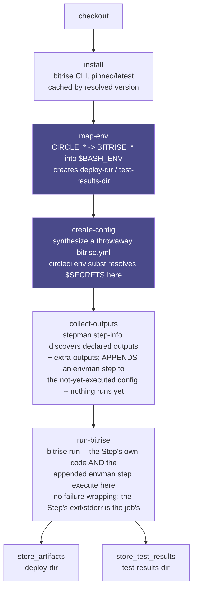
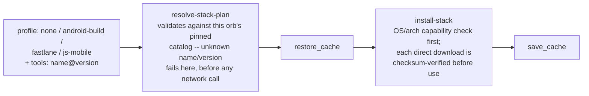

# Bitrise Orb (Unofficial) [](https://circleci.com/gh/CircleCI-Labs/bitrise-orb) [](https://circleci.com/developer/orbs/orb/cci-labs/bitrise) [](https://raw.githubusercontent.com/CircleCI-Labs/bitrise-orb/main/LICENSE) [](https://discuss.circleci.com/c/ecosystem/orbs)

This orb runs a single **[Bitrise Step](https://docs.bitrise.io/en/bitrise-ci/references/glossary#step)** as one step inside an otherwise-native CircleCI job, using Bitrise's own MIT-licensed [`bitrise` CLI](https://github.com/bitrise-io/bitrise) locally -- no bitrise.io account, app registration, or API token involved.

**Why:** Bitrise's StepLib has 400+ Steps, and a disproportionate number of the good ones are mobile-specific -- iOS code signing, Xcode archiving, fastlane, Android signing -- with no real CircleCI orb equivalent today. Teams migrating off Bitrise, or teams that just want to borrow one of those Steps, can run it as-is with this orb instead of reverse-engineering and rewriting it in shell.

---
**Disclaimer:**

CircleCI Labs, including this repo, is a collection of solutions developed by members of CircleCI's field engineering teams through our engagement with various customer needs.

-   ✅ Created by engineers @ CircleCI
-   ⚠️ **Not yet proven against a real, credential-bearing mobile-signing Step.** The two
    integration tests built specifically to exercise a real StepLib Step
    (`certificate-and-profile-installer`, `sign-apk`) are gated on a `bitrise-orb-mobile-testing`
    context that currently holds no secrets, and self-skip cleanly rather than fail --
    see "Gotchas worth knowing" below. Everything else in this repo (the plumbing:
    parameter handling, output export, the stack bootstrap, every security-regression
    test) runs green, unauthenticated, on every commit.
-   ❌ **not** officially supported by CircleCI support

---

## Scope: one Step per call, not a whole `bitrise.yml`

This orb runs **one Step**, not a whole `bitrise.yml` workflow. It is not a Bitrise-workflow importer or a Pipelines equivalent. Everything that would normally be a *separate* Bitrise Step in your old workflow -- checkout, caching, artifact upload -- has a native CircleCI equivalent already (`checkout`, `save_cache`/`restore_cache`, `store_artifacts`) and this orb expects you to keep using those directly rather than running Bitrise's own versions of them (see "Limits" below).

## Features

- Run any Bitrise Step by StepLib id (`xcode-archive@6`), by git URL (`git::https://github.com/bitrise-io/steps-script.git@1.1.3`), or by local path (`path::./my-step`) -- the full reference grammar, passed through verbatim.
- **No version-resolution logic of our own.** Omit `@<version>` and Bitrise resolves latest, exactly as it would locally -- this orb never second-guesses that.
- **Step outputs come back under their verbatim vendor name** (`BITRISE_IPA_PATH` stays `BITRISE_IPA_PATH`), exported into `$BASH_ENV` so a plain native `run` step right after can read them -- no separate artifact-download step, no orb-specific output syntax to learn. Bitrise's own config-level output aliasing is available too, if you want to rename one.
- Step inputs are a flat YAML block resolved through CircleCI's built-in `circleci env subst`, so `$MY_SECRET` resolves at run time and secrets never have to enter your committed config.
- **No failure wrapping.** If a Step errors because a required input or credential is missing, the job fails with that Step's own stderr on the console, unmodified -- no retries, no swallowed exit codes, no extra validation layer guessing at what the Step needs.
- Two named executors (`bitrise/macos`, `bitrise/machine`) with **no default** -- see "Choosing an executor" below for why.
- **Smart defaults: this orb owns its own lifecycle.** `store_artifacts` against `deploy-dir` and `store_test_results` against `test-results-dir` both run automatically, with zero config -- see "The environment variable mapping" below. Each is a boolean you can turn off if you'd rather do it yourself.
- **`bitrise/init-stack` bootstraps just the pinned slice of Bitrise's own Ubuntu/Android stack a Step actually needs** (Android build/sign, fastlane, Node.js) -- cached, checksum-verified, entirely opt-in. See "Stack bootstrap" below.

## How it works

A mental model, not a deep dive -- read this once before your first run, then treat the Quick start below as the thing you actually copy from.



**A second non-obvious ordering decision, easy to get backwards:** `collect-outputs` runs *before* `run-bitrise`, not after. `collect-outputs` doesn't read anything at the point it runs -- nothing has executed yet -- it only *appends* an extra Step to the still-unexecuted synthesized `bitrise.yml` that will export the target Step's outputs once the workflow actually runs. `run-bitrise` is what executes the whole synthesized workflow, target Step and appended output-exporter alike, in one `bitrise run`. Both stages have to have already written into `config-path` before `run-bitrise` touches it.

**The one non-obvious ordering decision that isn't about `run-bitrise`:** `map-env` runs *before* `create-config`, not after. `create-config` resolves `$MY_SECRET`-style references inside your `inputs`/`outputs` blocks via `circleci env subst` at the moment it authors the synthesized `bitrise.yml` -- a plain substitution against whatever is in the process environment *right then*, not a deferred runtime lookup inside Bitrise. Since `map-env` is what actually exports `$BITRISE_DEPLOY_DIR`, `$BITRISE_SOURCE_DIR`, etc., an input like `output_path: $BITRISE_DEPLOY_DIR/app.ipa` only resolves correctly if `map-env` has already run. Both stages are independently skippable (`skip-install`/`skip-map-env`) so a hand-rolled job chaining several Bitrise Steps can reuse an already-installed CLI or an already-applied mapping -- see "Chaining two Bitrise Steps" below -- but if you skip `map-env` outright, you're on your own for anything that depends on it.

Everything downstream of `run-bitrise` is this orb's own bookkeeping, not Bitrise's: `collect-outputs` never touches the Step's actual behavior, and the two `store_*` steps are just this orb calling CircleCI's own native primitives against directories it created itself.

**`bitrise/init-stack` is not part of this diagram** -- it's a separate, standalone, opt-in command with its own resolve -> restore_cache -> install -> save_cache flow (see "Stack bootstrap" below for its own diagram). Nothing above calls it; compose it yourself, typically via `pre-steps`, before whichever `bitrise/step` call needs the toolchain it installs.

## Mapping your existing config

If you're migrating a real `bitrise.yml`, here's the same Step, side by side. This is Android
signing exactly as it would appear inside a Bitrise workflow's `steps:` list -- Bitrise's own
list-of-single-key-maps shape:

```yaml
# bitrise.yml (Bitrise)
workflows:
  primary:
    steps:
    - sign-apk@2:
        inputs:
        - android_app: app/build/outputs/apk/release/app-release-unsigned.apk
        - keystore_url: $BITRISEIO_ANDROID_KEYSTORE_URL
        - keystore_password: $BITRISEIO_ANDROID_KEYSTORE_PASSWORD
        - keystore_alias: $BITRISEIO_ANDROID_KEYSTORE_ALIAS
        - private_key_password: $BITRISEIO_ANDROID_KEY_PASSWORD
```

```yaml
# .circleci/config.yml (this orb)
version: 2.1
orbs:
  bitrise: cci-labs/bitrise@1.0.0
workflows:
  android-release:
    jobs:
      - bitrise/step:
          executor: bitrise/machine
          id: sign-apk@2
          inputs: |
            android_app: app/build/outputs/apk/release/app-release-unsigned.apk
            keystore_url: $ANDROID_KEYSTORE_URL
            keystore_password: $ANDROID_KEYSTORE_PASSWORD
            keystore_alias: $ANDROID_KEYSTORE_ALIAS
            private_key_password: $ANDROID_KEY_PASSWORD
          context: android-signing
```

What actually changed, concept by concept:

- **A Bitrise "Step" becomes a `bitrise/step` command (inline, among native steps) or job
  (standalone, in a workflow's `jobs:` list)** -- there's no separate CircleCI vocabulary for
  it; it's just this orb's one unit of work. The `<step-id>@<version>` reference (`sign-apk@2`)
  passes through to the `id` parameter completely unchanged -- this orb does no version
  resolution of its own, so anything that resolves for `bitrise run` locally resolves here too.
- **Step `inputs` go from a list-of-single-key-maps to a flat `key: value` block.** This orb's
  `create-config` command converts your flat block back into Bitrise's own list shape internally
  when it synthesizes the throwaway `bitrise.yml` -- you're not fighting Bitrise's format, you're
  just not required to type its extra list/map ceremony by hand.
- **Where the vendor's env vars come from is the biggest mental shift.** On Bitrise,
  `$BITRISEIO_ANDROID_KEYSTORE_URL` lives in your Bitrise app's **Secrets** or the Workflow
  Editor's **Env Vars** tab in the bitrise.io web UI, injected at build time by Bitrise's own
  backend -- it's not really "in" the `bitrise.yml` you're reading, even though the YAML
  references it by name. On CircleCI there's no separate backend injecting anything: put the
  real secret value in a CircleCI **context** or **project environment variable**, reference it
  with a plain `$MY_VAR` inside `inputs:`, and this orb's `create-config` resolves it via
  `circleci env subst` at the moment it writes the synthesized config -- the secret's value never
  touches your committed `.circleci/config.yml`, same security property Bitrise's own Secrets
  give you, different mechanism.
- **What Bitrise's platform does for you that CircleCI does natively instead:** the Step's own
  outputs (`$BITRISE_SIGNED_APK_PATH`) land in `$BASH_ENV` automatically (see "Outputs" below)
  instead of Bitrise's `$BITRISE_DEPLOY_DIR`-plus-`deploy-to-bitrise-io` combo; this orb's
  `store-artifacts`/`store-test-results` defaults are the direct equivalent, already wired up
  with zero extra config (see "Environment variable mapping" below); and StepLib's own Step
  caching (git-cloning each Step's code) has no equivalent to port, because this orb's
  `install` command already caches the CLI + StepLib state that makes Step resolution fast on
  repeat runs.
- **What has no equivalent and needs a real decision on your part:** picking an executor.
  Bitrise's own **Stack** setting picked the OS for you; this orb never guesses (see "Choosing
  an executor" below) -- translate your old Stack name into `bitrise/macos` or `bitrise/machine`
  explicitly.

## Quick start

If your Bitrise workflow's signing Step shows up with **empty inputs** in an exported `bitrise.yml` (`certificate-and-profile-installer@1: {}`, no `certificate_url` at all), that's expected: on Bitrise, those values live in your Bitrise app's **Code Signing** settings page in the bitrise.io web UI, not in the YAML, and get injected at build time. That page is what you're actually copying `certificate_url`/`certificate_passphrase` out of below.

```yaml
version: 2.1
orbs:
  bitrise: cci-labs/bitrise@1.0.0
workflows:
  ios-code-signing:
    jobs:
      - bitrise/step:
          executor: bitrise/macos
          id: certificate-and-profile-installer@1
          inputs: |
            certificate_url: $IOS_CERTIFICATE_URL
            certificate_passphrase: $IOS_CERTIFICATE_PASSPHRASE
```

That's the whole thing -- five lines under the job invocation. For the most up-to-date parameter reference, visit [this orb's Registry page](https://circleci.com/developer/orbs/orb/cci-labs/bitrise#usage-examples). Three more complete, runnable examples:

### Reading a Bitrise Step's output from a native step, in the same job

The single most important thing this orb does: interleave a Bitrise Step with plain CircleCI steps.

```yaml
version: 2.1
orbs:
  bitrise: cci-labs/bitrise@1.0.0
jobs:
  build-ios-app:
    executor: bitrise/macos
    steps:
      - checkout
      - bitrise/step:
          checkout: false
          id: xcode-archive@6
          inputs: |
            project_path: MyApp.xcworkspace
            scheme: MyApp
            distribution_method: app-store
      - run:
          name: Use the .ipa Bitrise just built
          command: echo "xcode-archive produced $BITRISE_IPA_PATH"
      # No manual store_artifacts needed here -- store-artifacts defaults to true, so
      # bitrise/step already published /tmp/bitrise-orb/deploy for you.
workflows:
  ios-release:
    jobs:
      - build-ios-app:
          context: ios-signing
```

### A second platform, on cheap Linux

```yaml
version: 2.1
orbs:
  bitrise: cci-labs/bitrise@1.0.0
workflows:
  android-release:
    jobs:
      - bitrise/step:
          executor: bitrise/machine
          id: sign-apk@2
          inputs: |
            android_app: app/build/outputs/apk/release/app-release-unsigned.apk
            keystore_url: $ANDROID_KEYSTORE_URL
            keystore_password: $ANDROID_KEYSTORE_PASSWORD
            keystore_alias: $ANDROID_KEYSTORE_ALIAS
            private_key_password: $ANDROID_KEY_PASSWORD
          context: android-signing
```

### Chaining two Bitrise Steps that share machine state

Steps that depend on each other's on-disk or keychain state -- code signing, then building with it -- must run in the **same job**, via repeated `bitrise/step` **command** calls with `checkout: false` (and `skip-install`/`skip-map-env` on the later ones), **not** as separate `bitrise/step` **jobs**. Two `bitrise/step` jobs are two independent, ephemeral machines with no shared state, unlike Steps inside one Bitrise Workflow, which always share a machine -- wiring a "cert install" job into an "archive" job as two separate workflow jobs will fail to find the signing identity, with no hint that job isolation is the cause.

```yaml
version: 2.1
orbs:
  bitrise: cci-labs/bitrise@1.0.0
jobs:
  build-signed-ios-app:
    executor: bitrise/macos
    steps:
      - checkout
      - bitrise/step:
          checkout: false
          store-artifacts: false
          store-test-results: false
          id: certificate-and-profile-installer@1
          inputs: |
            certificate_url: $IOS_CERTIFICATE_URL
            certificate_passphrase: $IOS_CERTIFICATE_PASSPHRASE
            provisioning_profile_url: $IOS_PROVISIONING_PROFILE_URL
      - bitrise/step:
          checkout: false
          skip-install: true
          skip-map-env: true
          id: xcode-archive@6
          inputs: |
            project_path: MyApp.xcworkspace
            scheme: MyApp
            distribution_method: app-store
          # store-artifacts/store-test-results default to true, so THIS call is the one
          # that actually publishes /tmp/bitrise-orb/deploy -- the first call above
          # disabled its own copy of the same default since nothing was built yet.
      - run:
          name: Use the .ipa Bitrise just built
          command: echo "xcode-archive produced $BITRISE_IPA_PATH"
workflows:
  ios-release:
    jobs:
      - build-signed-ios-app:
          context: ios-signing
```

Note also that **`bitrise/step` is both a job name and a command name** -- `src/jobs/step.yml` (used under a workflow's `jobs:`, as in the Quick Start above) and `src/commands/step.yml` (used inside an existing job's `steps:`, as in this example and the two above it) are different things that happen to share a name, distinguished only by where they appear in your config.

## Choosing an executor

A Bitrise Step declares nothing machine-readable about needing macOS: `host_os_tags` in a Step's `step.yml` is documented by Bitrise as "currently unused," and `project_type_tags` (`ios`, `android`, `flutter`, ...) is search/filter metadata only, not enforced. So this orb never guesses -- you pick `bitrise/macos` or `bitrise/machine` explicitly on every `bitrise/step` job. Guessing wrong would mean either a confusing failure (an iOS Step on Linux) or roughly 10x the credit cost (an Android Step needlessly run on macOS).

If you're migrating an existing Bitrise workflow, the fastest way to translate is by the **Stack** it used to run on (Workflow Editor -> Stack, or `meta: bitrise.io: stack:` in an exported `bitrise.yml` -- this orb doesn't read or emit that key itself; it's a bitrise.io hosting concept with no local-CLI meaning, and your CircleCI executor choice *is* its replacement):

| Old Bitrise Stack (naming pattern) | Use this executor |
|---|---|
| `osx-xcode-*` (any macOS/Xcode stack) | `bitrise/macos` |
| `linux-docker-android-*` / any Linux stack | `bitrise/machine` |
| `ubuntu-jammy-22.04-bitrise-*` / `ubuntu-noble-24.04-bitrise-*` (Bitrise's newer yearly-edition Linux stack naming) | `bitrise/machine` |

This table is a migration aid for humans reading their old Stack setting, not something this orb parses -- always cross-check against what the specific Step actually needs (its `type_tags`/`project_type_tags`, or just whether it shells out to `xcodebuild`/`security`).

### A third, opt-in executor: `bitrise/android-toolchain`

`bitrise/machine` installs whatever a Step needs itself (this orb's own `install` command handles the Bitrise CLI; anything an Android Step needs beyond that -- an SDK, an NDK, a specific Ruby -- is on you, same as it would be on a bare Bitrise Linux stack without the toolchain preinstalled). If you'd rather start from Bitrise's own published Android/Linux image instead, `bitrise/android-toolchain` is a `docker` executor defaulting to `quay.io/bitriseio/android-20.04:latest`.

**Use this only if you know why:** it's a 10+GB image, amd64-only, and -- verified directly against Quay's tag metadata while building this orb -- a snapshot last published 2024-01-08, not a live mirror of bitrise.io's current hosted stack. Check the tools actually inside it before trusting it (see the executor's own description). For most Steps, `bitrise/machine` plus this orb's own `init-stack` command (below) is the safer default; reach for this one specifically when a Step assumes a real Android toolchain is already on `PATH` and you've confirmed this image's versions are close enough to what you need.

**Caching the image, and what it costs:** `docker-layer-caching` (DLC) on this executor defaults to `true` for exactly this reason -- without it, every job pays this image's full 10+GB pull. DLC is a **paid, plan-gated CircleCI feature** (check your plan before relying on it) that caches at the Docker *layer* level, so a small upstream tag bump often only re-pulls the top layer instead of the whole image. Rule of thumb across this orb: leave DLC off (the `bitrise/machine` executor's own default) for anything under roughly 50MB -- a plain pull is already faster than the cache round-trip -- and turn it on for anything in this image's class. This is also why this orb doesn't hand-roll a `docker save`/`load` cache of its own: DLC already does that job, at a finer (per-layer) grain, for free once you're on a plan that includes it.

## Stack bootstrap

`bitrise/init-stack` installs the **pinned subset** of Bitrise's own Ubuntu/Android stack toolchain that a real, popular Bitrise Step cluster was confirmed to need -- not a mirror of the whole stack (that's what `bitrise/android-toolchain` above is for, with its own honestly-documented staleness/size tradeoff). It's a standalone command: nothing in this orb calls it for you, so skipping it outright is just never invoking it.



| `profile` | Installs | OS/arch |
|---|---|---|
| `none` (default) | Nothing beyond the always-on `zstd` fix (see below) | any |
| `android-build` | OpenJDK (apt) + Android SDK platform-tools / one build-tools / one platform -- **no emulator, no NDK** | Linux/x86_64 only |
| `fastlane` | Ruby (apt) + the fastlane gem | Linux only |
| `js-mobile` | Node.js (direct download) + npm/Yarn/corepack | Linux or macOS, x86_64 or arm64 |

Add ad hoc tools beyond a profile with `tools: "ripgrep,gh"` (or pin explicitly, `ripgrep@14.1.1`) -- names and versions are checked against this orb's own pinned catalog; anything else fails the step loudly rather than being silently skipped. `install-zstd` (default `true`) always runs regardless of `profile`, because `zstd` is a hard, confirmed dependency of current-generation Bitrise cache Steps (`restore-cache`/`save-cache` both declare it) -- nothing depending on it should silently break just because you didn't ask for a profile.

**Why this, and not a bigger/smaller thing:** the research behind this command read Bitrise's own machine-readable stack manifest ([`bitrise-io/stacks`](https://github.com/bitrise-io/stacks), a JSON transcript refreshed continuously against real stack VMs -- the two pullable vendor images are years stale by comparison, see "A third, opt-in executor" above) and cross-referenced it against 20 real StepLib Steps' own declared dependencies and Go source. `zstd`, a JDK+Android-SDK slice, Ruby+fastlane, and Node.js are the only things any of those Steps actually call; ripgrep/gh/AWS CLI/gcloud/Nix/etc. all appear in Bitrise's tools inventory but zero sampled first-party Step declares or calls any of them -- they're supported only via the explicit `tools:` override, not installed by default, because "a tool nothing uses is not worth installing."

**Integrity, per install path (deliberately not uniform):**

| Install path | Verified by |
|---|---|
| apt packages (JDK, Ruby, `build-essential`, `zstd`, `unzip`) | APT's own signed `Release` files |
| the fastlane gem | RubyGems' own checksum protocol |
| Android SDK packages `sdkmanager` itself fetches (platform-tools, platforms, build-tools) | `sdkmanager`, against Google's own signed repository manifest |
| the Android cmdline-tools bootstrap zip, and the Node.js tarball | **this orb**, against a checksum vendored in `src/scripts/install-stack.sh`, fetched directly from Google's/Node's own manifests and reviewable via a plain `git diff` |

Because that last row's checksums are pinned to one exact version each, `node-version` (unlike `fastlane-version`, `jdk-version`, `android-platform`, `android-build-tools` -- all freely overridable, since something *else* verifies them) must match the one version this orb vendors a checksum for; overriding it without also adding a checksum fails loudly rather than skip verification.

**Caching, and what's honestly NOT cached:** `init-stack` caches everything it downloads directly (the Android SDK root, the fastlane gem's `GEM_HOME`, the Node.js install, and any `tools` catalog binaries), keyed on the exact resolved profile+tools+versions -- a warm run's install step is a handful of directory-existence checks, no network calls. What it can't cache: **apt package installs themselves** (JDK, Ruby, `zstd`) -- `bitrise/machine` is a fresh VM every job, so `apt-get install` pays its own real cost (a network round-trip plus package unpack) on every single run regardless of this orb's own cache state. That's an inherent property of the machine executor, not something `init-stack` failed to solve -- see the measured timings below for exactly what that costs in practice.

**Measured timings** (`bitrise/machine`, `medium` resource class, the `Installing stack toolchain` step's own duration, from this repo's own real CI runs -- pipelines #21/#22 for cold, #25 for warm):

| Profile | Cold (empty cache) | Warm (cache hit) |
|---|---|---|
| `none` (zstd only) | 0.49s | 0.46s |
| `android-build` | 12.3s | 0.57s |
| `fastlane` | 40.8s | **16.4s** |
| `js-mobile` | 2.9s | 0.37s |
| `tools: "ripgrep,gh"` | 1.1s | 0.33s |

**`fastlane`'s warm number is not a bug** -- it's the "what's honestly NOT cached" caveat above, measured: `apt-get install ruby-full build-essential` re-runs in full on every job regardless of cache state (this specific machine image doesn't carry `ruby-full`/`build-essential` preinstalled, unlike `openjdk-17-jdk-headless`, which this image *does* already carry -- which is also exactly why `android-build`'s apt step is nearly free here specifically; a different/custom base image is not guaranteed to have either preinstalled). Only the Android SDK/gem-install/Node-install portions of each profile are actually being measured going from 12.3s/2.9s to sub-second above -- the apt-package portions are inherent, per-job cost on the machine executor, not something this command failed to cache.

`init-stack`'s own resolve -> restore_cache -> install -> save_cache shape deliberately mirrors `install.yml`'s (the Bitrise CLI's own install command) -- that command was already the reference pattern for "resolve first, checksum the resolved value, cache by that checksum" before this one existed; `init-stack` doesn't share code with it (each `<<include(...)>>`'d script is packed as an independent, self-contained command body -- see `resolve-stack-plan.sh`'s own comment), but it follows the same shape on purpose.

## The environment variable mapping

`bitrise/step` exports these into `$BASH_ENV` before running the Step (via the `map-env` command), so Bitrise Steps that read the usual `BITRISE_*` build-metadata variables see sensible values with zero configuration. Add to or override any of them with the `extra-env` parameter.

| CircleCI | Bitrise |
|---|---|
| `CIRCLE_SHA1` | `BITRISE_GIT_COMMIT` |
| `CIRCLE_BRANCH` | `BITRISE_GIT_BRANCH` |
| `CIRCLE_TAG` | `BITRISE_GIT_TAG` |
| `CIRCLE_BUILD_NUM` | `BITRISE_BUILD_NUMBER` |
| `CIRCLE_PROJECT_REPONAME` | `BITRISE_APP_TITLE` |
| (job's working directory) | `BITRISE_SOURCE_DIR` |
| (the `deploy-dir` parameter, created for you) | `BITRISE_DEPLOY_DIR` |
| (the `test-results-dir` parameter, created for you) | `BITRISE_TEST_DEPLOY_DIR` |

**This orb owns its own lifecycle by default (Locked Decision: smart defaults).** `bitrise/step` automatically runs `store_artifacts` against `deploy-dir` (default `/tmp/bitrise-orb/deploy`) and `store_test_results` against `test-results-dir` (default `/tmp/bitrise-orb/test-results`) right after the Step -- that's this orb's equivalent of `deploy-to-bitrise-io`. You never need to write either step yourself. Set `store-artifacts: false` / `store-test-results: false` to disable either one (e.g. to call `store_artifacts` yourself with different options, or because you're chaining multiple `bitrise/step` calls in one job and only want the last one to publish -- see "Chaining two Bitrise Steps" above).

Bitrise documents `$BITRISE_DEPLOY_DIR` and `$BITRISE_TEST_DEPLOY_DIR` as two **distinct** directories -- deploy artifacts vs. JUnit-XML test results -- so this orb creates and exports both separately, and defaults `store_test_results` at the test-results one specifically. Only certain Steps (`android-unit-test`, `xcode-test`, and similar) actually populate `$BITRISE_TEST_DEPLOY_DIR`; running an arbitrary third-party Step through this orb may deposit nothing there, which is a silent no-op for `store_test_results`, not a failure.

Because the generated `store_artifacts`/`store_test_results` steps are templated from the exact same `deploy-dir`/`test-results-dir` orb parameters that get exported into `$BASH_ENV`, there's no path to type twice and no way for the two to drift apart -- override `deploy-dir` (or `test-results-dir`) once and both the export and the generated step move together. If you disable the defaults and write your own `store_artifacts`/`store_test_results` step instead, that step's own `path:` field still can't take a runtime environment-variable substitution (only a literal, compile-time-known path), so in that case only, you're back to typing the path yourself and keeping it in sync by hand.

## Interleaving native CircleCI steps around the Bitrise Step

The `bitrise/step` **job** (only when invoked from a workflow's `jobs:` list, not the `bitrise/step`
**command** inside another job's own `steps:`) accepts CircleCI's own built-in `pre-steps`/`post-steps`
arguments -- available on every 2.1+ job, not something this orb declares. Pass them at the call site:

```yaml
- bitrise/step:
    executor: bitrise/macos
    id: xcode-archive@6
    inputs: |
      project_path: MyApp.xcworkspace
      scheme: MyApp
    pre-steps:
      - run: echo "before checkout AND before the Bitrise Step"
    post-steps:
      - run: echo "after the Bitrise Step; its outputs are already in $BASH_ENV"
```

**One real platform caveat, verified while re-checking this orb's expansion order (`pre-steps`, job
steps, `post-steps`):** `pre-steps` run before **every** step in the job, including this job's own
internal `checkout` -- not just before the Bitrise Step. If a pre-step needs the repo checked out
first, either do that checkout yourself inside the pre-step, or use `checkout: false` on the job
plus an explicit `checkout` as the first entry of `pre-steps`, so you control exactly where it
lands relative to your other pre-steps:

```yaml
- bitrise/step:
    executor: bitrise/macos
    checkout: false
    id: xcode-archive@6
    inputs: |
      project_path: MyApp.xcworkspace
      scheme: MyApp
    pre-steps:
      - checkout
      - run: echo "runs after checkout, still before the Bitrise Step"
    post-steps:
      - store_artifacts:
          path: /tmp/bitrise-orb/deploy
```

Need several native steps and several Bitrise Steps interleaved in a specific order within one job
(not just "before all" / "after all")? Reach for the `bitrise/step` **command** in a hand-rolled job
instead -- see "Chaining two Bitrise Steps that share machine state" above -- since a command call is
just one entry in an ordinary `steps:` list and can sit anywhere in it.

## Outputs

By default, `bitrise/step` exports every output the Step's own `step.yml` **declares**, discovered via `stepman step-info` -- no maintained list, no guessing (see "Step outputs come back under their verbatim vendor name" above). That covers the overwhelming majority of Steps.

It does **not** cover a Step whose `step.yml` declares zero outputs but whose own code still calls `envman add` for one anyway -- which is exactly how Bitrise's own docs show passing a value between Steps from a `script` Step. Without an escape hatch, this does nothing on this orb, silently, with a green build:

```yaml
- bitrise/step:
    id: script@1
    inputs: |
      content: envman add --key APP_VERSION --value "$(cat VERSION)"
- run: echo "version is $APP_VERSION"    # empty -- script@1 declares no outputs
```

Use `extra-outputs` to name it explicitly -- a newline-separated list of environment variable **names** (no values), unioned with whatever the Step declares:

```yaml
- bitrise/step:
    id: script@1
    inputs: |
      content: envman add --key APP_VERSION --value "$(cat VERSION)"
    extra-outputs: |
      APP_VERSION
- run: echo "version is $APP_VERSION"    # now populated
```

`extra-outputs` entries are exported verbatim under their own name only -- they're not eligible for Bitrise's config-level output aliasing (the `outputs` parameter), since that mechanism only knows about a Step's *declared* outputs.

**Treat every Step output as public log content.** This orb never masks an output value -- it exports whatever the Step produced straight into `$BASH_ENV`, unredacted, and any later step that echoes it (directly, or indirectly via its own error output) puts it on the console exactly like any other unmasked variable. CircleCI's log masking only ever catches an *exact-match* registered secret; a Step output that's a derived value, a URL with embedded credentials, or a value composed from a secret plus other text is not something masking will catch. If a Step's output could be sensitive, don't assume this orb (or CircleCI) hides it for you.

**This orb also refuses to let a Step's output (declared, or named via `extra-outputs`) overwrite a reserved shell variable** -- `PATH`, `BASH_ENV`, `IFS`, `LD_PRELOAD`, and about a dozen others. Without that guard, a Step (or a malicious/compromised one reached via `git::`/`path::`) that called `envman add --key PATH --value "/tmp/evil:$PATH"` could poison every *later* native step in the job, not just its own -- this orb's whole point is running someone else's Step code, so this is refused outright rather than exported.

## Passing data between jobs

`bitrise/step`'s output-export mechanism above is job-scoped, not workflow-scoped -- exactly like any other `$BASH_ENV` export in CircleCI, it doesn't cross a job boundary on its own. Two real needs, two different real answers:

- **Passing a Step's output VALUE to a downstream job:** write it to a file, then `persist_to_workspace` that file in the job that produced it and `attach_workspace` in the job that needs it. This works today, with zero orb changes:
  ```yaml
  - run: echo "$BITRISE_IPA_PATH" > /tmp/workspace/ipa-path.txt
  - persist_to_workspace:
      root: /tmp/workspace
      paths: [ipa-path.txt]
  # ...in the downstream job:
  - attach_workspace: { at: /tmp/workspace }
  - run: export IPA_PATH="$(cat /tmp/workspace/ipa-path.txt)"
  ```
- **Branching which jobs RUN, based on an upstream job's output** (a genuinely harder ask -- conditional workflow logic driven by runtime data): CircleCI has no native construct for this. The closest real mechanism is a setup workflow plus the `circleci/continuation` orb, where an early job computes a value and calls `continuation/continue` with a config whose `workflows:` block is shaped by that value. There is no simpler answer available today; don't expect a lighter-weight substitute.

## Limits

A specific, identifiable slice of Bitrise Steps call back to bitrise.io's own hosted services with no substitution point -- these fail outside a real Bitrise build not because the CLI blocks them, but because *that Step's own code* calls a bitrise.io endpoint this orb has no account behind. Re-implement these against CircleCI's native equivalents instead of running the Bitrise Step:

| Doesn't work | Why | Use instead |
|---|---|---|
| **Virtual Device Testing** (Android/iOS) | Proxies to Firebase Test Lab under **Bitrise's own** Firebase license and build-slug identity, not yours. | A CircleCI-native device-testing integration, or Firebase Test Lab directly under your own GCP project. |
| **Deploy to Bitrise.io** | Authenticates against Bitrise's own Artifacts/Tests backend with a build-scoped `$BITRISE_BUILD_API_TOKEN` this orb never has. | `store_artifacts` / `store_test_results` on `$BITRISE_DEPLOY_DIR` / `$BITRISE_TEST_DEPLOY_DIR` -- already automatic by default, see above. |
| **Bitrise Build Cache** (Gradle/Bazel/Xcode remote cache) | A co-located, datacenter-local cache/proxy service gated behind a Bitrise workspace token. | Your build tool's own remote-cache config pointed at infrastructure you control, or plain CircleCI `save_cache`/`restore_cache`. |
| **Save/Restore Cache Steps** (and the dependency-manager-specific ones: Cocoapods, Gradle, SPM, ...) | The cache archive store is scoped to "your Bitrise project" and billed/retained per Bitrise plan -- it isn't something you can point at other infrastructure. | `save_cache`/`restore_cache` with the same keys/paths the dedicated Step would have used. |
| **`register_test_devices` input on `xcode-archive`/`manage-ios-code-signing`** | Registers "the known test devices **on Bitrise** from team members" with the Apple Developer Portal -- that device roster lives in Bitrise's own account data, not exposed via an API this orb could substitute. | Register test devices directly in the Apple Developer portal, or via `fastlane`'s own `register_devices` action with your own Apple credentials. |
| **Unity license activation Step(s)** | Unity license *pools* are configured in Bitrise Workspace settings -- the pooling/allocation UX is bitrise.io-only, though the actual `Unity -serial ...` activation call itself goes straight to Unity (more a config-portability gap than a true hard blocker). | Manage your own Unity license/serial directly, outside Bitrise's pooling UI. |

By contrast, **iOS/Android code signing itself is not a hard blocker**: `xcode-archive`, `manage-ios-code-signing`, and the `fastlane` Step all expose an explicit "bring your own Apple/Google credentials" override (an App Store Connect API key, or `connection: off`) that talks directly to Apple/Google, sidestepping bitrise.io's backend entirely -- that's exactly the path the examples above use.

## Gotchas worth knowing before your first run

- **macOS requires Homebrew.** `bitrise setup` hard-requires it even in minimal mode. CircleCI's standard macOS executor images ship it, so this is low-risk, but it's the first thing to check if `install` fails on a custom image. This repo's own CI runs an unconditional (no-credentials-needed) `bitrise/install` + trivial Step on `bitrise/macos` on every commit specifically so a broken macOS install path can't hide behind the credential-gated signing tests below.
- **This orb runs a Step NATIVELY, with no container boundary -- unlike a `docker run`-based bridge.** A Bitrise Step (or a `git::`/`path::` reference to one) executes directly in the job's own shell/process, with everything the job has: the full checkout, every sourced context/project secret, the network, and on `machine`, the Docker socket and host filesystem outright. This is inherent to how `bitrise run` works, not something this orb adds or could sandbox away -- treat "run a Bitrise Step through this orb" as exactly as trusting as "run this Step's code directly in this job," because that's what it is.
- **The synthesized `bitrise.yml` (`config-path`, default `.bitrise-orb.generated.yml`) contains every resolved Step input/output value, including secrets, once `create-config` has run.** It's written inside your checkout on purpose (so `path::`-relative Step references resolve), but that also means a `persist_to_workspace`/`store_artifacts` pattern pointed broadly at `.` elsewhere in the same job will durably persist that file, plaintext, as a workspace object or artifact -- somewhere CircleCI's console log masking doesn't reach the same way it reaches stdout. Scope any broad artifact/workspace glob to exclude it if you use one.
- **This orb's console output never dumps that file by default** (`debug-dump-config`, default `false`, gates it) -- but the file on disk always has the resolved values regardless of whether you ever print it, which is what the bullet above is really about.
- **`bitrise run` auto-loads a file literally named `.bitrise.secrets.yml` from the working directory, with no flag needed.** If your repo happens to contain one, its values get silently picked up. This orb doesn't delete or otherwise touch that file -- it's a Bitrise CLI behavior, not this orb's.
- **This orb passes every Step input through verbatim and does not validate it (by design -- see "No failure wrapping" above).** A typo in an input name won't be caught by this orb; the Step's own error message is what you'll see, exactly as if you'd run `bitrise run` locally. It'll appear after a fair amount of orb-plumbing output (CLI install, cache restore, `bitrise setup`) -- look for the "Running Bitrise Step" step's own output specifically.
- **Bitrise's Go-toolkit Steps are compiled from source on first use per machine/version**, not shipped as prebuilt binaries -- expect the first run of a new Step+version to take a few seconds longer than subsequent cached runs.
- **Every direct binary download this orb makes is checksum-verified against a table vendored in this repo** (the Bitrise CLI and `yq`, via `install`; the Android cmdline-tools zip and the Node.js tarball, via `init-stack`) -- `verify-checksums`/`ORB_VAL_VERIFY_CHECKSUMS` defaults to `true` everywhere it appears. Don't turn it off outside local debugging of this orb itself.

## Legal / compliance

This orb implements Step execution purely by installing and shelling out to Bitrise's own
MIT-licensed [`bitrise` CLI](https://github.com/bitrise-io/bitrise) locally, exactly as
`bitrise setup && bitrise run` would behave for any user -- it does not read, copy, or fork
that CLI's source, and it never contacts bitrise.io's own backend (no account, no API token,
no build-slug identity). Steps themselves are fetched from StepLib (or the git/local source you
point `id` at) under whatever license that specific Step publishes -- check a Step's own
`step.yml`/repository before relying on it in a context where that matters, the same diligence
you'd apply running it directly with `bitrise run` yourself.

## Commands and job reference

| Name | Kind | What it does |
|---|---|---|
| `step` | command, job | The aggregate most users want: install -> map-env -> create-config -> collect-outputs -> run-bitrise -> store_artifacts/store_test_results, in order. |
| `install` | command | Resolves and installs the Bitrise CLI + `yq`, checksum-verified, cached by resolved version. |
| `map-env` | command | Exports the CircleCI -> Bitrise variable mapping into `$BASH_ENV`; creates `deploy-dir`/`test-results-dir`. |
| `create-config` | command | Synthesizes the throwaway `bitrise.yml` for exactly one Step, resolving `$SECRET`-style references via `circleci env subst`. |
| `collect-outputs` | command | Discovers the Step's declared outputs (`stepman step-info`) and appends an output-exporting Step to the not-yet-executed config. |
| `run-bitrise` | command | `bitrise run`s the synthesized config -- the actual execution point for both the target Step and the appended output exporter. |
| `init-stack` | command | **Standalone, opt-in.** Bootstraps the pinned subset of Bitrise's stack toolchain a Step needs (`profile`) plus any ad hoc `tools`, cached and checksum-verified. See "Stack bootstrap" above. Not part of the `step` aggregate -- compose it yourself, e.g. via `pre-steps`. |

**Reach for the granular commands instead of the `step` aggregate when:** you're chaining two or
more Bitrise Steps that must share on-disk/keychain state in one job (see "Chaining two Bitrise
Steps" above -- `skip-install`/`skip-map-env` on the later calls avoid redundant work), or when
you want native CircleCI steps interleaved at a point finer than `pre-steps`/`post-steps` allow.

### `step` (command and job) parameters

| Parameter | Type | Default | What it does |
|---|---|---|---|
| `executor` *(job only)* | executor | *(required)* | `bitrise/macos` or `bitrise/machine` -- no default; see "Choosing an executor." |
| `checkout` | boolean | `true` | Check out the project first. |
| `id` | string | *(required)* | The Step reference (`<id>@<version>`, `git::<url>@<ref>`, or `path::<local-path>`). |
| `inputs` | string | `""` | Flat `key: value` block of the Step's inputs; `$SECRET` resolved via `circleci env subst`. |
| `outputs` | string | `""` | Flat `ORIGINAL_KEY: alias` block for Bitrise's own output-aliasing. Leave empty to export verbatim vendor names. |
| `extra-outputs` | string | `""` | Newline-separated env var **names** to export in addition to the Step's declared outputs -- for Steps that call `envman add` without declaring an output in `step.yml`. |
| `step-lib-source` | string | Bitrise's official StepLib URL | Where to resolve `id` against when it has no explicit source prefix. |
| `bitrise-version` | string | `"latest"` | Bitrise CLI version to install. |
| `bin-dir` | string | `/tmp/bitrise-orb/bin` | Install directory for the CLI + `yq`. |
| `cache-key-prefix` | string | `"v1"` | Prefix on every cache key this orb writes; bump to force a clean cache. |
| `verify-checksums` | boolean | `true` | Checksum-verify the Bitrise CLI + `yq` downloads before use. Never disable outside local debugging of this orb itself. |
| `deploy-dir` | string | `/tmp/bitrise-orb/deploy` | Exported as `$BITRISE_DEPLOY_DIR`; also what `store-artifacts` publishes. |
| `store-artifacts` | boolean | `true` | Auto-run `store_artifacts` against `deploy-dir` after the Step. |
| `test-results-dir` | string | `/tmp/bitrise-orb/test-results` | Exported as `$BITRISE_TEST_DEPLOY_DIR`; also what `store-test-results` publishes. |
| `store-test-results` | boolean | `true` | Auto-run `store_test_results` against `test-results-dir` after the Step. |
| `extra-env` | string | `""` | Extra/override `NAME: value` pairs, applied after the built-in mapping (these win). |
| `skip-default-env-mapping` | boolean | `false` | Skip the built-in CircleCI -> Bitrise mapping entirely. |
| `config-path` | string | `.bitrise-orb.generated.yml` | Where the synthesized `bitrise.yml` is written. |
| `workflow-name` | string | `"orb-step"` | Name of the workflow inside the synthesized config. |
| `skip-install` | boolean | `false` | Skip installing the CLI (an earlier call in this job already did). |
| `skip-map-env` | boolean | `false` | Skip exporting the env mapping (an earlier call in this job already did). |
| `skip-collect-outputs` | boolean | `false` | Skip discovering/exporting the Step's outputs. |
| `debug-dump-config` | boolean | `false` | Print the fully-resolved synthesized `bitrise.yml` to the console (security review, Finding #3 -- may contain resolved secrets). Off by default; local debugging of this orb only. |

Individual commands (`install`, `map-env`, `create-config`, `collect-outputs`, `run-bitrise`)
expose the matching subset of these same parameters, under the same names -- see each command's
own description on the [Orb Registry page](https://circleci.com/developer/orbs/orb/cci-labs/bitrise)
for the exhaustive, always-current list.

### `init-stack` parameters

Standalone -- not part of `step`'s parameter set above. See "Stack bootstrap" for the full picture.

| Parameter | Type | Default | What it does |
|---|---|---|---|
| `profile` | enum | `"none"` | `none` \| `android-build` \| `fastlane` \| `js-mobile`. |
| `tools` | string | `""` | Comma-separated `name@version` catalog additions (currently: `ripgrep`, `gh`); unrecognized names/versions fail loudly. |
| `install-zstd` | boolean | `true` | Install `zstd` regardless of `profile` (a hard dependency of current-gen Bitrise cache Steps). |
| `jdk-version` | string | `"17"` | `android-build` only. |
| `android-platform` | string | `"35"` | `android-build` only. |
| `android-build-tools` | string | `"35.0.0"` | `android-build` only. |
| `android-sdk-root` | string | `/tmp/bitrise-orb/android-sdk` | `android-build` only; exported as `$ANDROID_HOME`/`$ANDROID_SDK_ROOT`. |
| `fastlane-version` | string | `"2.236.1"` | `fastlane` only; freely overridable (RubyGems verifies it, not this orb). |
| `gem-home` | string | `/tmp/bitrise-orb/gems` | `fastlane` only; exported as `$GEM_HOME`/`$GEM_PATH`. |
| `node-version` | string | `"22.22.0"` | `js-mobile` only; **not** freely overridable -- must match this orb's vendored checksum. |
| `node-root` | string | `/tmp/bitrise-orb/node` | `js-mobile` only. |
| `stack-bin-dir` | string | `/tmp/bitrise-orb/stack-bin` | Where `tools` catalog binaries land. |
| `cache-key-prefix` | string | `"v1"` | Same convention as `step`'s. |
| `verify-checksums` | boolean | `true` | Checksum-verify every direct download (apt/gem/`sdkmanager` installs verify themselves already -- see "Stack bootstrap"'s integrity table). |

### Worked example: composing the granular commands by hand

The same two chained Steps from "Chaining two Bitrise Steps" above, but built entirely from the
individual commands instead of `step`, to show the exact order that has to hold (`map-env` before
`create-config`; `collect-outputs` before `run-bitrise`):

```yaml
version: 2.1
orbs:
  bitrise: cci-labs/bitrise@1.0.0
jobs:
  build-signed-ios-app:
    executor: bitrise/macos
    steps:
      - checkout
      - bitrise/install
      - bitrise/map-env
      - bitrise/create-config:
          id: certificate-and-profile-installer@1
          inputs: |
            certificate_url: $IOS_CERTIFICATE_URL
            certificate_passphrase: $IOS_CERTIFICATE_PASSPHRASE
      - bitrise/collect-outputs:
          id: certificate-and-profile-installer@1
      - bitrise/run-bitrise
workflows:
  ios-release:
    jobs:
      - build-signed-ios-app:
          context: ios-signing
```

## Resources

- [cci-labs/bitrise on the CircleCI Orb Registry](https://circleci.com/developer/orbs/orb/cci-labs/bitrise) -- the auto-generated reference for every parameter this orb exposes, always up to date with the latest published version.
- [CircleCI Orbs documentation](https://circleci.com/docs/orbs/introduction-to-orbs/)
- [Bitrise Step Library](https://www.bitrise.io/integrations/steps) -- browse Steps and their inputs/outputs before referencing them here.

## How to Contribute

Bug reports and feature requests are welcome via [Issues](https://github.com/CircleCI-Labs/bitrise-orb/issues). Pull requests are welcome via the usual GitHub flow.

**CircleCI CLI version floor: `>= 1.0.48254`.** Older CLI builds silently pack this orb's `<<include(...)>>` directives as literal text instead of expanding them, producing a broken orb that can still pass `circleci orb validate` -- a false green with no other symptom. Run `scripts/check-circleci-cli-version.sh` (also wired into `.circleci/config.yml`'s `lint-pack` workflow) before packing locally if you're not sure which build you have.

**`pre-steps`/`post-steps` are reserved job-parameter names.** `circleci orb validate` rejects a job parameter literally named `pre-steps` or `post-steps` outright -- this only surfaces under `orb validate`, which needs a token, so a plain `circleci config validate`/pack will not catch it. If you're adding a new job parameter, don't pick either name.

## How to Publish An Update

1. Merge PRs using squash-merge with a [Conventional Commits](https://www.conventionalcommits.org/)-style message.
2. Check the current published version: `circleci orb info cci-labs/bitrise | grep "Latest"`.
3. Create a new GitHub Release with a new semver tag (`vX.Y.Z`).
4. Click "+ Auto-generate release notes."
5. Verify the semver bump you're about to publish actually matches what the generated notes describe (a breaking change needs a major bump, not a patch).
6. Click "Publish Release" -- pushing that `vX.Y.Z` tag is what satisfies this repo's production-publish gate.
