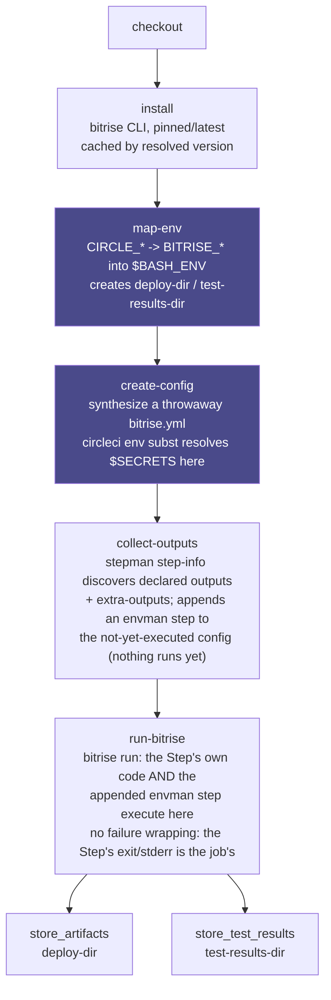
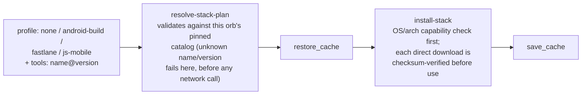

# Architecture

## How it works

This is a mental model, not a deep dive. Read it once before your first run, then treat the [Quick start](../README.md#quick-start) as the thing you actually copy from.

**A second non-obvious ordering decision, easy to get backwards:** `collect-outputs` runs *before* `run-bitrise`, not after. `collect-outputs` doesn't read anything at the point it runs (nothing has executed yet); it only *appends* an extra Step to the still-unexecuted synthesized `bitrise.yml` that will export the target Step's outputs once the workflow actually runs. `run-bitrise` is what executes the whole synthesized workflow, target Step and appended output-exporter alike, in one `bitrise run`. Both stages have to have already written into `config-path` before `run-bitrise` touches it.

**The one non-obvious ordering decision that isn't about `run-bitrise`:** `map-env` runs *before* `create-config`, not after. `create-config` resolves `$MY_SECRET`-style references inside your `inputs`/`outputs` blocks via `circleci env subst` at the moment it authors the synthesized `bitrise.yml`: a plain substitution against whatever is in the process environment *right then*, not a deferred runtime lookup inside Bitrise. Since `map-env` is what actually exports `$BITRISE_DEPLOY_DIR`, `$BITRISE_SOURCE_DIR`, etc., an input like `output_path: $BITRISE_DEPLOY_DIR/app.ipa` only resolves correctly if `map-env` has already run. Both stages are independently skippable (`skip-install`/`skip-map-env`), so a hand-rolled job chaining several Bitrise Steps can reuse an already-installed CLI or an already-applied mapping (see ["Chaining two Bitrise Steps"](GETTING-STARTED.md#chaining-two-bitrise-steps-that-share-machine-state) in Getting Started). If you skip `map-env` outright, though, you're on your own for anything that depends on it.

Everything downstream of `run-bitrise` is this orb's own bookkeeping, not Bitrise's: `collect-outputs` never touches the Step's actual behavior, and the two `store_*` steps are just this orb calling CircleCI's own native primitives against directories it created itself.

**`bitrise/init-stack` is not part of this diagram.** It's a separate, standalone, opt-in command with its own resolve -> restore_cache -> install -> save_cache flow (see [Stack bootstrap](#stack-bootstrap) below for its own diagram). Nothing above calls it; compose it yourself, typically via `pre-steps`, before whichever `bitrise/step` call needs the toolchain it installs.

## The environment variable mapping

`bitrise/step` exports these into `$BASH_ENV` before running the Step (via the `map-env` command), so Bitrise Steps that read the usual `BITRISE_*` build-metadata variables see sensible values with zero configuration. Add to or override any of them with the `extra-env` parameter.

| CircleCI | Bitrise |
|---|---|
| `CIRCLE_SHA1` | `BITRISE_GIT_COMMIT` |
| `CIRCLE_BRANCH` | `BITRISE_GIT_BRANCH` |
| `CIRCLE_TAG` | `BITRISE_GIT_TAG` |
| `CIRCLE_BUILD_NUM` | `BITRISE_BUILD_NUMBER` |
| `CIRCLE_PROJECT_REPONAME` | `BITRISE_APP_TITLE` |
| (job's working directory) | `BITRISE_SOURCE_DIR` |
| (the `deploy-dir` parameter, created for you) | `BITRISE_DEPLOY_DIR` |
| (the `test-results-dir` parameter, created for you) | `BITRISE_TEST_DEPLOY_DIR` |

**This orb owns its own lifecycle by default (Locked Decision: smart defaults).** `bitrise/step` automatically runs `store_artifacts` against `deploy-dir` (default `/tmp/bitrise-orb/deploy`) and `store_test_results` against `test-results-dir` (default `/tmp/bitrise-orb/test-results`) right after the Step: that's this orb's equivalent of `deploy-to-bitrise-io`. You never need to write either step yourself. Set `store-artifacts: false` / `store-test-results: false` to disable either one (e.g. to call `store_artifacts` yourself with different options, or because you're chaining multiple `bitrise/step` calls in one job and only want the last one to publish; see ["Chaining two Bitrise Steps"](GETTING-STARTED.md#chaining-two-bitrise-steps-that-share-machine-state)).

Bitrise documents `$BITRISE_DEPLOY_DIR` and `$BITRISE_TEST_DEPLOY_DIR` as two **distinct** directories (deploy artifacts vs. JUnit-XML test results), so this orb creates and exports both separately, and defaults `store_test_results` at the test-results one specifically. Only certain Steps (`android-unit-test`, `xcode-test`, and similar) actually populate `$BITRISE_TEST_DEPLOY_DIR`. Running an arbitrary third-party Step through this orb may deposit nothing there, which is a silent no-op for `store_test_results`, not a failure.

Because the generated `store_artifacts`/`store_test_results` steps are templated from the exact same `deploy-dir`/`test-results-dir` orb parameters that get exported into `$BASH_ENV`, there's no path to type twice and no way for the two to drift apart: override `deploy-dir` (or `test-results-dir`) once and both the export and the generated step move together. If you disable the defaults and write your own `store_artifacts`/`store_test_results` step instead, that step's own `path:` field still can't take a runtime environment-variable substitution (only a literal, compile-time-known path). In that case only, you're back to typing the path yourself and keeping it in sync by hand.

## Defaults that deviate from Bitrise's own CLI

This orb intentionally overrides three of `bitrise run`'s own out-of-the-box behaviors. All three are overridable and every one is a real, current default, not a defect, but a user coming from a bare `bitrise run` or Bitrise's own published install instructions would be surprised by them if they weren't called out:

| Parameter | Bitrise's own default | This orb's default | Why |
|---|---|---|---|
| `store-artifacts` | Off: a workflow only publishes deploy artifacts if it explicitly includes Bitrise's own `deploy-to-bitrise-io` Step (see the "Doesn't work: Deploy to Bitrise.io" row in [Limits](LIMITS.md); that Step itself has no local-CLI equivalent at all). | `true` | This orb's `store_artifacts` against `deploy-dir` is the local-CLI-reachable substitute for `deploy-to-bitrise-io` (see "The environment variable mapping" above). Publishing by default matches what most CI users expect from a build step that produces an installable artifact. |
| `store-test-results` | Off, for the same reason: nothing in a bare `bitrise run` publishes JUnit XML anywhere by default. Only specific Steps (`android-unit-test`, `xcode-test`, ...) write `$BITRISE_TEST_DEPLOY_DIR` at all, and nothing reads it back without an explicit Step. | `true` | Same rationale as `store-artifacts`, above. A Step that never populates `$BITRISE_TEST_DEPLOY_DIR` makes this a silent no-op, not a failure, so defaulting it on costs nothing when it doesn't apply. |
| `verify-checksums` | Off: Bitrise's own published install instructions (`github.com/bitrise-io/bitrise`, and its Homebrew formula) fetch the release binary directly with no checksum-verification step of their own. | `true` | This orb downloads and executes the Bitrise CLI and `yq` on every job; verifying the checksum before running either is a stricter, safer default than the vendor's own install path, and costs one hash comparison per cold cache. |

## Stack bootstrap

`bitrise/init-stack` installs the **pinned subset** of Bitrise's own Ubuntu/Android stack toolchain that a real, popular Bitrise Step cluster was confirmed to need, not a mirror of the whole stack (that's what `bitrise/android-toolchain`, covered in [Getting Started](GETTING-STARTED.md#choosing-an-executor), is for, with its own honestly-documented staleness/size tradeoff). It's a standalone command: nothing in this orb calls it for you, so skipping it outright is just never invoking it.

| `profile` | Installs | OS/arch |
|---|---|---|
| `none` (default) | Nothing beyond the always-on `zstd` fix (see below) | any |
| `android-build` | OpenJDK (apt) + Android SDK platform-tools / one build-tools / one platform. **No emulator, no NDK.** | Linux/x86_64 only |
| `fastlane` | Ruby (apt) + the fastlane gem | Linux only |
| `js-mobile` | Node.js (direct download) + npm/Yarn/corepack | Linux or macOS, x86_64 or arm64 |

Add ad hoc tools beyond a profile with `tools: "ripgrep,gh"` (or pin explicitly, `ripgrep@14.1.1`): names and versions are checked against this orb's own pinned catalog, and anything else fails the step loudly rather than being silently skipped. `install-zstd` (default `true`) always runs regardless of `profile`, because `zstd` is a hard, confirmed dependency of current-generation Bitrise cache Steps (`restore-cache`/`save-cache` both declare it). Nothing depending on it should silently break just because you didn't ask for a profile.

**Why this, and not a bigger or smaller thing:** see [ROADMAP.md](ROADMAP.md) item 1. In short, a 20-Step sample of real StepLib dependencies only ever called `zstd`, a JDK+Android-SDK slice, Ruby+fastlane, and Node.js; everything else in Bitrise's own stack tooling inventory is opt-in via `tools:` instead of default.

Integrity, caching, and measured timings (per install path)

**Integrity, per install path (deliberately not uniform):**

| Install path | Verified by |
|---|---|
| apt packages (JDK, Ruby, `build-essential`, `zstd`, `unzip`) | APT's own signed `Release` files |
| the fastlane gem | RubyGems' own checksum protocol |
| Android SDK packages `sdkmanager` itself fetches (platform-tools, platforms, build-tools) | `sdkmanager`, against Google's own signed repository manifest |
| the Android cmdline-tools bootstrap zip, and the Node.js tarball | **this orb**, against a checksum vendored in `src/scripts/install-stack.sh`, fetched directly from Google's/Node's own manifests and reviewable via a plain `git diff` |

Because that last row's checksums are pinned to one exact version each, `node-version` must match the one version this orb vendors a checksum for (unlike `fastlane-version`, `jdk-version`, `android-platform`, and `android-build-tools`, which are all freely overridable since something *else* verifies them). Overriding it without also adding a checksum fails loudly rather than skip verification.

**Caching, and what's honestly not cached:** `init-stack` caches everything it downloads directly (the Android SDK root, the fastlane gem's `GEM_HOME`, the Node.js install, and any `tools` catalog binaries), keyed on the exact resolved profile+tools+versions. A warm run's install step is a handful of directory-existence checks, no network calls. What it can't cache is the **apt package installs themselves** (JDK, Ruby, `zstd`): `bitrise/machine` is a fresh VM every job, so `apt-get install` pays its own real cost (a network round-trip plus package unpack) on every single run regardless of this orb's own cache state. That's an inherent property of the machine executor, not something `init-stack` failed to solve; see the measured timings below for exactly what that costs in practice.

**Measured timings** (`bitrise/machine`, `medium` resource class, the `Installing stack toolchain` step's own duration, from this repo's own real CI runs: pipelines #21/#22 for cold, #25 for warm):

| Profile | Cold (empty cache) | Warm (cache hit) |
|---|---|---|
| `none` (zstd only) | 0.49s | 0.46s |
| `android-build` | 12.3s | 0.57s |
| `fastlane` | 40.8s | **16.4s** |
| `js-mobile` | 2.9s | 0.37s |
| `tools: "ripgrep,gh"` | 1.1s | 0.33s |

**`fastlane`'s warm number is not a bug.** It's the "what's honestly not cached" caveat above, measured: `apt-get install ruby-full build-essential` re-runs in full on every job regardless of cache state (this specific machine image doesn't carry `ruby-full`/`build-essential` preinstalled, unlike `openjdk-17-jdk-headless`, which this image *does* already carry; that's also exactly why `android-build`'s apt step is nearly free here specifically, though a different or custom base image is not guaranteed to have either preinstalled). Only the Android SDK, gem-install, and Node-install portions of each profile are actually being measured going from 12.3s/2.9s to sub-second above. The apt-package portions are an inherent, per-job cost on the machine executor, not something this command failed to cache.

`init-stack`'s own resolve -> restore_cache -> install -> save_cache shape deliberately mirrors `install.yml`'s (the Bitrise CLI's own install command): that command was already the reference pattern for "resolve first, checksum the resolved value, cache by that checksum" before this one existed. `init-stack` doesn't share code with it (each `<<include(...)>>`'d script is packed as an independent, self-contained command body; see `resolve-stack-plan.sh`'s own comment), but it follows the same shape on purpose.

